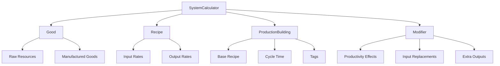

# Anno 1800 Production Calculator

A Python-based production chain calculator for Anno 1800, designed to model complex production systems with optimization capabilities.

## 🎯 Overview

This project provides a flexible and extensible framework for calculating production chains in Anno 1800. It supports both base calculations (without optimizations) and optimized scenarios that minimize the number of buildings by applying the best available modifiers.

## 🏗️ Architecture

The system is built using a modular, object-oriented architecture with strict type hints:



### Core Classes

#### `Good`
Represents commodities (raw resources or manufactured products):
- **Raw goods**: Cannot be produced (e.g., iron ore, clay)
- **Manufactured goods**: Require production chains

#### `Recipe`
Defines transformations with precise throughput rates:
- Input/output rates in tons per minute
- Supports complex multi-input/multi-output recipes

#### `ProductionBuilding`
Models production facilities:
- Base recipe and cycle time
- Tags for modifier targeting
- Electrification capability
- Workforce requirements with type (Workers, Artisans, Engineers, etc.)
- Buildable locations (Old World, New World, Enbesa, Arctic)

#### `Modifier`
Represents optimization factors:
- **Productivity**: Increases production efficiency
- **Input Replacement**: Substitutes input materials
- **Extra Output**: Adds bonus production every X cycles
- **Workforce Reduction**: Reduces required workers

#### `SystemCalculator`
The main orchestration engine:
- Manages all system components
- Calculates production chains recursively
- Supports both base and optimized scenarios

## 🚀 Usage

### Basic Example

```python
from system_calculator import SystemCalculator
from good import Good
from recipe import Recipe
from production_building import ProductionBuilding
from modifier import Modifier

# Initialize calculator
calculator = SystemCalculator()

# Create goods
grain = Good("Grain", is_raw=True)
flour = Good("Flour", is_raw=False)
bread = Good("Bread", is_raw=False)

# Create recipe
bread_recipe = Recipe(
    inputs={"Flour": 1.0},
    outputs={"Bread": 0.8}
)

# Create building
bakery = ProductionBuilding(
    name="Bakery",
    base_recipe=bread_recipe,
    cycle_time_seconds=45,
    tags=["Production", "Old World"],
    is_electrifiable=True
)

# Add to calculator
calculator.add_good(grain)
calculator.add_good(flour)
calculator.add_good(bread)
calculator.add_building(bakery)

# Calculate production chain
result = calculator.calculate_production_chain("Bread", 10.0, optimized=False)
```

### Running the Demo

```bash
python3 main.py
```

This will demonstrate:
- Base scenario calculation (no optimizations)
- Optimized scenario calculation (with modifiers)
- Comparison of efficiency improvements

## 📊 Features

### Production Chain Calculation
- **Recursive analysis**: Automatically calculates all required sub-chains
- **Rate-based**: All calculations use tons per minute for precision
- **Building optimization**: Minimizes required buildings through modifiers
- **Workforce tracking**: Calculates total workforce requirements by type
- **Location support**: Shows where buildings can be placed

### Modifier System
- **Flexible targeting**: Uses tags to determine applicability
- **Multiple effect types**: Productivity, input replacement, extra outputs
- **Automatic optimization**: Finds best modifier combinations

### Output Format
The system returns detailed production trees including:
- Required building counts and locations
- Applied modifiers and productivity
- Workforce requirements by type (per building and total)
- Input requirements
- Complete sub-chain breakdown

## 🔧 Technical Details

### Type Safety
- Full type hints throughout the codebase
- Strict typing for all method signatures and attributes
- Enhanced IDE support and error detection

### Extensibility
- Modular design allows easy addition of new goods, recipes, and modifiers
- Placeholder optimization logic ready for complex algorithms
- Clean separation of concerns

### Performance
- Efficient recursive calculations
- Minimal memory overhead
- Scalable to complex production chains

## 📁 Project Structure

```
Anno1800ProdCalc/
├── good.py                 # Good class definition
├── recipe.py              # Recipe class definition
├── modifier.py            # Modifier class definition
├── production_building.py # ProductionBuilding class definition
├── system_calculator.py   # Main calculation engine
├── main.py               # Demo and example usage
└── README.md             # This file
```

## 🎮 Game Integration

This calculator is designed to work with Anno 1800's production mechanics:

- **Cycle-based production**: Respects building cycle times
- **Modifier compatibility**: Supports all game modifier types
- **Multi-world support**: Handles Old World, New World, and Arctic production
- **Electricity system**: Models electrification bonuses

## 🔮 Future Enhancements

- [ ] Complex optimization algorithms for modifier selection
- [ ] Database integration for game data
- [ ] Web interface for easy calculations
- [ ] Export functionality (JSON, CSV, etc.)
- [ ] Cost analysis and optimization
- [ ] Multi-objective optimization (buildings vs. space vs. cost)

## 🤝 Contributing

This project welcomes contributions! Please ensure:
- All code includes proper type hints
- Documentation is updated for any changes
- Tests are added for new functionality
- Code follows the existing style guidelines

## 📄 License

This project is open source and available under the MIT License.